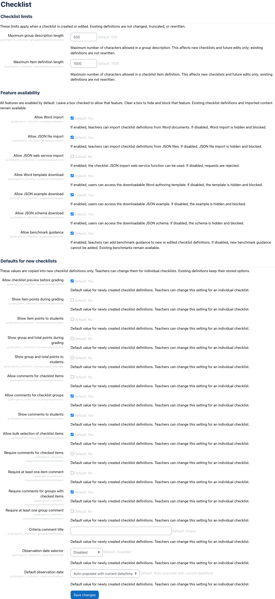

# Checklist settings

Checklist settings is a Moodle local plugin that provides a site administration
settings page for the Checklist advanced grading method plugin
(`gradingform_checklist`).

Copyright 2026 John Braz.

## Why this plugin exists

Some Moodle versions do not load `settings.php` files from advanced grading form
plugins. This companion plugin exposes the same administration settings through a
standard local plugin while storing all values in the `gradingform_checklist`
configuration namespace.

If the Moodle site already loads the Checklist grading method's own settings
page, this companion plugin does not add a duplicate settings page.

## Features

- Adds a Checklist settings page to Moodle site administration when needed.
- Stores all values in the existing `gradingform_checklist` configuration
  namespace.
- Controls Checklist feature availability, import/export options, text limits,
  and defaults for newly created checklist definitions.
- Requires no database tables, scheduled tasks, capabilities, web services, or
  event observers.
- Can remain installed after Moodle core or local core patches begin loading
  grading form settings directly.

## Screenshot



## Requirements

| Component | Supported versions |
| --- | --- |
| Moodle | 4.5 or later |
| Checklist grading method | `gradingform_checklist` `2026081200` or later |
| PHP | The PHP versions supported by the target Moodle release |

## Installation

Install this plugin in:

```text
local/checklistsettings
```

Then visit the Moodle upgrade page or run the Moodle CLI upgrade command.

```bash
php admin/cli/upgrade.php
php admin/cli/purge_caches.php
```

## Configuration

After installation, go to:

```text
Site administration > Grades > Grading methods > Checklist settings
```

The settings control Checklist feature availability, text limits, import/export
options, and defaults for newly created checklist definitions. Existing
checklist definitions are not rewritten when these settings change.

## Upgrade Notes

Upgrade this plugin by replacing the files in `local/checklistsettings`, then
run the Moodle upgrade process and purge caches.

The companion plugin writes settings into `gradingform_checklist`, so upgrades
should preserve existing Checklist configuration values.

## Uninstall Notes

Uninstalling this plugin removes the companion administration page only. Runtime
Checklist behaviour remains owned by `gradingform_checklist`.

Moodle plugin configuration values stored under `gradingform_checklist` are not
owned by this local plugin and should be reviewed separately if they need to be
removed.

## Compatibility

This plugin is intended for Moodle sites where grading form plugin settings are
not available through the standard administration tree. On sites where Moodle
already loads `gradingform_checklist/settings.php`, this plugin detects the
existing Checklist settings page and avoids adding a duplicate page.

The first supported release line is `1.x`.

## Testing Status

The plugin has been checked with:

- PHP syntax checks for all plugin PHP files.
- Moodle install and upgrade testing in a Moodle 4.5 test site.
- Patched-core compatibility testing, confirming no duplicate settings page is
  added when Moodle already loads Checklist grading method settings.
- Fallback testing, confirming the companion page appears when grading form
  settings are not loaded by Moodle core.
- Configuration checks, confirming saved values use the
  `gradingform_checklist` namespace.

## Data Storage

This plugin does not create database tables and does not store personal data. It
stores administrator configuration values in Moodle's plugin configuration table
using the `gradingform_checklist` component namespace so the Checklist advanced
grading method can read them directly.

## Privacy

This plugin has a null Moodle privacy provider because it does not store or
process personal data.

## Security

Please report security vulnerabilities through GitHub private vulnerability
reporting:

https://github.com/Portvgal/moodle-local_checklistsettings/security/advisories/new

Use public GitHub issues only for non-security bugs, feature requests, and
documentation improvements.

## Marketplace Packaging

Package this plugin from the repository root and install it as
`local/checklistsettings`. Release archives should include source, language
strings, tests, documentation, screenshots, and the GPL license. They should not
include `.git`, generated reports, temporary files, local Moodle installations,
or Docker artifacts.

## Issue Tracker

Repository:

https://github.com/Portvgal/moodle-local_checklistsettings

Non-security issues:

https://github.com/Portvgal/moodle-local_checklistsettings/issues

## License

GNU GPL v3 or later.
